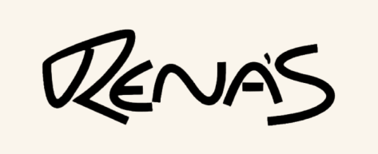

<div align="center">
  

  <h1>Rena's Bar e Restaurante</h1>

  <p>Landing page institucional criada para apresentar o restaurante, sua história, seus pratos, seu ambiente e seus canais de atendimento.</p>

  <p>
    
    
    
  </p>

  <a href="https://renasrestaurante.netlify.app/">Acessar o site</a>
</div>

---

## Sobre o projeto

O projeto foi desenvolvido para fortalecer a presença digital do **Rena's Bar e Restaurante** e reunir, em um só lugar, as principais informações que os clientes precisam antes de visitar o estabelecimento.

A página apresenta o restaurante de forma moderna e acolhedora, destacando sua identidade, seu chef, suas especialidades, o ambiente, os diferenciais e as formas de contato. Por ser uma landing page estática, o acesso é rápido e não exige cadastro ou instalação.

## Principais recursos

- Navegação por seções em uma única página;
- apresentação da história e da proposta do restaurante;
- seção dedicada ao Chef Renan;
- cards de especialidades com detalhes em modal;
- galeria de imagens com navegação interativa;
- informações de localização e funcionamento;
- formulário integrado ao WhatsApp;
- alternância entre tema claro e escuro;
- menu adaptado para dispositivos móveis;
- favicon personalizado com a identidade do Rena's;
- layout responsivo para celulares, tablets e computadores.

## Seções da landing page

| Seção | Conteúdo |
|---|---|
| **Início** | Apresentação principal e acesso rápido às informações do restaurante. |
| **Sobre** | História, proposta e experiência oferecida pelo Rena's. |
| **Chef** | Apresentação do profissional responsável pelos pratos. |
| **Especialidades** | Destaque para opções gastronômicas e seus detalhes. |
| **Galeria** | Imagens do espaço, dos pratos e dos eventos. |
| **Diferenciais** | Características que tornam a experiência no restaurante especial. |
| **Localização** | Endereço, mapa e informações úteis para a visita. |
| **Contato** | Envio de mensagem diretamente para o WhatsApp do estabelecimento. |

## Tecnologias utilizadas

<div align="center">
  
  
  
  
  
</div>

- **HTML5:** estrutura e organização do conteúdo;
- **Tailwind CSS:** estilização, temas e responsividade;
- **JavaScript:** menu mobile, modais, galeria, formulário e troca de tema;
- **Git e GitHub:** versionamento e publicação do código-fonte.

## Estrutura do projeto

```text
Renas-LandingPage-main/
├── assets/
│   ├── chef-renan.webp
│   ├── evento.webp
│   ├── favicon.ico
│   ├── favicon.png
│   ├── hero.webp
│   ├── logo-renas.png
│   ├── logo-renas-black.png
│   ├── logo-renas-readme.png
│   ├── logo-renas-dark.png
│   └── restaurante.webp
├── js/
│   └── script.js
├── index.html
├── .gitattributes
└── README.md
```

## Design e experiência

A identidade visual combina tons escuros, dourados e claros para transmitir elegância e aconchego. As animações, os cards, os modais e a galeria ajudam a tornar a navegação mais dinâmica sem comprometer a simplicidade da página.

O projeto também foi ajustado para oferecer uma boa experiência em diferentes tamanhos de tela, incluindo o funcionamento dos modais e dos controles no celular.

## Objetivo

O principal objetivo da landing page é funcionar como uma vitrine digital do Rena's, permitindo que novos clientes conheçam o estabelecimento e encontrem rapidamente informações importantes, como especialidades, localização, ambiente e contato.

## Status

O projeto está **concluído e funcional**. Novas imagens, pratos, eventos e informações poderão ser adicionados futuramente conforme as necessidades do restaurante.

---

<div align="center">
  <h3>Desenvolvido por Evelyn Vareiro</h3>
  <a href="https://github.com/EvelynVareiro">
    
  </a>
  <br><br>
  <strong>Boa comida, ambiente acolhedor e momentos especiais.</strong>
</div>
